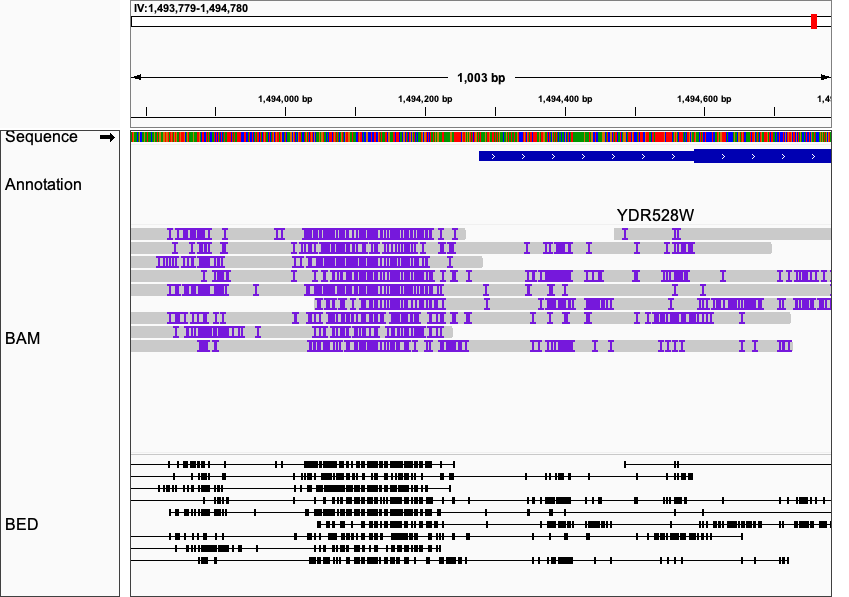

<h1 align="center">
  Single-Molecule Methyladenosine Finder on SLURM cluster
  <br>
</h1>

This program predicts single-molecule 

<p align="center">
  <a href="#key-features">Key Features</a> •
  <a href="#how-to-use">How To Use</a> •
  <a href="#input-file-format">Input File Format</a> •    
  <a href="#output-file-format">Output File Format</a> •  
  <a href="#contact">Contact</a> 
</p>

## Example Output File in IGV

> Detailed specifications in Output File Format
> 
> BAM Output: The m6A sites are indicated as insertion sites (purple "I').
> 
> BED Format: Each line represented one consensus read. 
> Each block represented 1 m6A site
> 
> Note: BED file requires that the first Block starts in the beginning of the read,
> and that the last Block ends in the end of the read. However, we used the blocks for 
> m6A sites that cannot statisfy such requirement. IGV could still view the BED files 
> (while UCSC cannot), but the read before the first and last m6A site
> is not shown in IGV.


## Key Features

* Fast analysis pipeline of methyladenosine sites from PacBio subreads on SLURM cluster.
* Consensus N6-methyladenosine sites on circular consensus reads
* BAM format ready for IGV viewer
* BED format for easy downstream analysis

## How To Use
To clone and run this application on slurm cluster, you'll need [SMRTLINK](https://www.pacb.com/support/software-downloads/) deployed on SLURM cluster; [pysam](https://pysam.readthedocs.io/), [Biopython](https://biopython.org/) and [samtools](http://www.htslib.org/) are also required.

  [Installation](#Installation) • [Preprocess](#Preprocess) • [Predict m6A sites](#predict-m6a-sites) •
 [m6A Prediction on local machine (Experimental)](#experimental-predict-m6a-sites-locally)


### Installation
```bash
# Clone this repository
$ git clone https://github.com/zhuweix/MethyladenosineFinder.git

# Install dependencies using Conda (Except SMRTLink)
# For SMRTLink installation, please follow the documentation on PacBio website (https://www.pacb.com/support/software-downloads/)
# Optional: use new conda environment to manage python packages
$ conda create --name maw python=3.7
$ conda activate maw
 
# Install dependencies
$ conda install numpy
$ conda install -c bioconda pysam biopython samtools

# Go into the repository
$ cd MethyladenosineFinder
# setup the python package
$ python setup.py install
```
### Preprocess
```bash
# prepare reference index
$ m6apreprocess index \
     -r [Reference.FASTA] \
     -o [Reference_index.data]
# IMPORTANT: REMEMBER TO MAKE THE FAIDX file otherwise PacBIO ipdSummary will FAIL.
$ samtools faidx [Reference.FASTA]

# Recommended: Filter the Subreads using the PacBio CCS reads
# Get ZMW list by num_pass and AverageQual in PacBio CCS reads
$ m6apreprocess zmwfromccs \
     --bam [PacBio_CCS.bam] \
     --output [ZMW_list.txt] \
     --qual [Min_AveQual, Default=90] \
     --cov [Min_NumPass, Default=3]
# Filter subreads using the ZMW list (alternatively, bamsieve tool from PacBio SMRT Tools could also be used)
$ m6apreprocess filtersubread \
     --bam [PacBio_Subreads.bam] \
     --zmw [ZMW_list.txt] \
     --output [Filtered_Subreads.bam]   

# Align the Subreads to Reference using pbmm2 from SMRT Tools
$ pbmm2 index [Reference.FASTA] [Reference.mmi]
$ pbmm2 align [Reference.mmi] [PacBio_Subreads.bam | Filtered_Subreads.bam] \
     [Output_Aligned_Sorted_Subreads.bam] --preset SUBREAD --sort \
     -j 16 [Threads for alignment] \
     -J 8 [Threads for sorting]
# index the aligned bam file using pbindex from SMRT Tools
$ pbindex [Output_Aligned_Sorted_Subreads.bam]
$ samtools index [Output_Aligned_Sorted_Subreads.bam]

```
### Predict m6A sites
```bash
# Generate the batch script
$ m6aworkflow  \
    --bam [AlignedSubreads.bam | FilteredAlignedSubreads.bam] \
    --ref [Reference.FASTA] \
    --index [Reference_index.data] \ # Indexed Reference for Adenine locations, see preprocess
    [Optional parameters]
    --prefix [Prefix] \ # Prefix of the sbatch files and output files; Default=ouput    
    --scorefn [CSV for for pvalue threshold] \ # Default=src/asset/default_cov_score.csv
    --splittime [Timelimit (min) to split BAM file by ZMW] \ # Default=600
    --ipdtime [Timelimit (min) to predict m6a sites] \ # Default=600
    --mergetime [Timelimit (min) to Merge bam files and to generate final output] \ # Default=100
    --timeout [Timelimit (s) to predict m6A sites for one concensus read] \ # Default=600
    --sbatchdir [Folder for SBATCH files for SLURM submission] \  # Default=./sh 
    --outputdir [Folder for Output BAM files] \ # Default=./output
    --tmpdir [Folder for Temporary Files] \ # Default=./tmp/
    --logdir [Folder for Log Files] \ # Default=./log/
    --jobname [JobName For Slurm] \ # Default=maw
    --coverage [MinCoverage] \ # Default=6
    --mem [SLURM mem parameter] \ # Default=20g
    --gres [SLURM GRES parameter for local scratch space] \ # Default=lscratch
    --ipdbatch [BatchSize] \# Number of ZMWs per SLURM array job; Default=500
    --threads [Threads ONLY for samtools]  \ # Default=16
    --isclean True # Whether to clean most of the tmp files Default=True

# IMPORTANT NOTICE: The number of Batch array jobs submitted to SLURM is [Number of ZMWs] / [BatchSize], very small batchsize will result in a large amount of SLURM jobs
```
> The sbatch commands are stored in [Prefix].pipeline
```bash
# Follow the workflow to submit the batch script
# The commands are stored in [Prefix].pipeline
## Example Pipeline file
## The sbatch parameters are in the 
# Split Subreads by ZMW: Large Number of Files will be generated!
$ sbatch \
	--mem 20g \
	--gres=lscratch:40 \
	--job-name mawsplit \
	--time 600  \
    [output.split.sh] 

# Predict m6A sites
# output.ipd_analysis.sh is generated after output.split.sh
sbatch \
        --mem 20g \
        --gres=lscratch:10 \
        --time 600 \
        --job-name mawipd \
        [output.ipd_analysis.sh] 

# Merge Reads
sbatch \
        --mem 20g \
        --gres=lscratch:10 --time 100 \
        --cpus-per-task=16 \
        --job-name mawmer \
        [output.merge.sh]

# [Optional] Transform BAM file to BED file for m6A sites
$ m6abamtobed --bam [m6A_sites.BAM] --bed [m6A_sites.bed]
```
> **Note**
> 
> The current workflow is tested with SMRTLink/11.1.0.166339
> 
> The BED Output is only valid for IGV viewer, not for UCSC browser.
> This is because the first Block in BED format must start in beginning of the reads
> and because the last Block must end in the end of read. Since we are using blocks to
> indicate m6A sites. We have to add False Pseudo Sites in the beginning or in the end of the read.

### [Experimental] Predict m6A sites locally
```bash
# Most of the parameters are similar with the SLURM version
$ m6aworkflowlocal  \
    --bam [AlignedSubreads.bam | FilteredAlignedSubreads.bam] \
    --ref [Reference.FASTA] \
    --index [Reference_index.data] \ # Indexed Reference for Adenine locations, see preprocess
    [Optional parameters]
    --prefix [Prefix] \ # Prefix of the sbatch files and output files; Default=ouput    
    --scorefn [CSV for for pvalue threshold] \ # Default=src/asset/default_cov_score.csv
    --timeout [Timelimit (s) to predict m6A sites for one concensus read] \ # Default=600
    --shdir [Folder for SH files for SLURM submission] \  # Default=./sh 
    --outputdir [Folder for Output BAM files] \ # Default=./output
    --tmpdir [Folder for Temporary Files] \ # Default=./tmp/
    --coverage [MinCoverage] \ # Default=6
    --isclean True # Whether to clean most of the tmp files Default=True

```

## Input File Format
* BAM file of PacBio subreads aligned to the reference genome
    - We tested our pipeline with the aligned BAM file using pbalign for SMRTLINK
```bash
# Example command
$ pbmm2 index [refererence.fa] [reference.mmi]

$ pbmm2 align \
    [reference.mmi] \
    [RawSubreads.bam] \
    [AlignedSubreads.bam] \
    --sort -j 32 -J 8 --preset SUBREAD 

$ samtools index -@ 8 [AlignedSubreads.bam]

```
* [Optional] BAM file of PacBio CCS reads
  
  We use the average base quality score to filter the raw subreads. The default setting is to filter ZMWs with >= 90 average base quality and >= 3 passes in the CCS reads. This process is highly recommended to reduce the ZMWs with insufficient quality for methyladenosine prediction.

## Output File Format
* BAM format

This format is ready for IGV viewer. The methyladenosine sites are indicated as insertions.

* BED format

This format is easy for further downstream analyze. 
Each line represents the consensus methyladenosine sites from one ZMW. 
The name of each line is the same in PacBio BAM file.
The ChromStart and ChromEnd is the 

> Note
> 
> 
> For subreads within one ZMW that aligned to multiple 
genome locations, the name of the associated line is 
{movieName}/{holeNumber}/{Number} where Numer=1,2,3... 
for each location (currently, we only support multiple alignments 
within the same chromosome/reference, for reads with alignments
in multiple chromosomes/references, the chromosome with highest
alignment is used).
> 


---
## Contact
> [David Clark Lab](https://www.nichd.nih.gov/research/atNICHD/Investigators/clark)
> 
> GitHub [@zhuweix](https://github.com/zhuweix)

